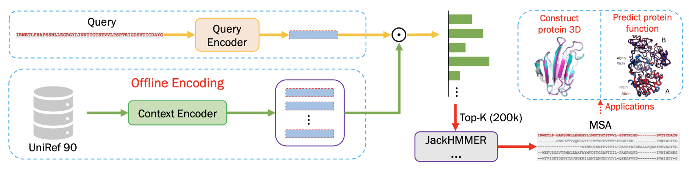
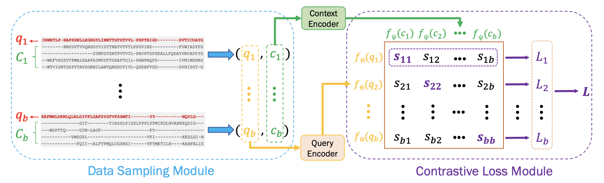

# fastMSA
fastMSA provides a way to efficiently build multiple sequence alignments by substituting the time-consuming identity search with a bi-encoder powered similarity search, achieving a 34-fold speed-up.

## How does it work?
### Pipeline overview

The top-K most similar sequences will be retrieved using dot product, then JackHMMER is applied on this small retrieved dataset to build the MSA for further tasks, such as 3D structure prediction or protein function prediction. Before retrieval, the UniRef90 can be encoded into vectors offline, and it will NOT affect the inference time of building MSA.

### Bi-encoder model

We use a query encoder and a context encoder. The dataset is encoded using the context encoder offline while the query encoder is used during inference.

## Quick stark

- download the model `pth` file and set the path `path_to_model`
- download the context encoding to directory `path_to_ctx`, the provided ctx encoding is based on UniRef90 2018.3, change it into two-line format and set the path as `path_to_ur90`
- `cd app`
- set the three paths in retrieve_app-v6.py then use the command `streamlit run retrieve_app-v6.py`

if you would like to use your own database:
- `cd dense_encode`
- `mkdir $CTXDIR`
- set `save_path` arg in gen_u90.py as `$CTXDIR`
- decide whether to use multiple GPUs. Note that it takes around 24h to encode 70M sequences using 4 V100 GPUs.
  * single card: 
    - set `DISTRIBUTED=False` in gen_u90.py
    - `python3 gen_u90.py`
  * distributed mode:
    - set `DISTRIBUTED=True` in gen_u90.py
    - `python3 -m torch.distributed.launch --nproc_per_node=4 generate_vec_one.py`

## Training
- `cd train`
- `mkdir saved_model`
- identify the number of GPUs and decide whether a parellel training should be used
  * single card mode: 
    - set `DISTRIBUTED` arg in main.py as false
    - `python3 main.py`
  * distributed mode:
    - set `DISTRIBUTED` arg in main.py as True
    - `python3 -m torch.distributed.launch --nproc_per_node=$NUM_OF_GPU main.py`

## Dependencies
- torch
- [phylopandas](https://github.com/heathcliff233/phylopandas)
- streamlit
- wandb
- fair-esm
- faiss
